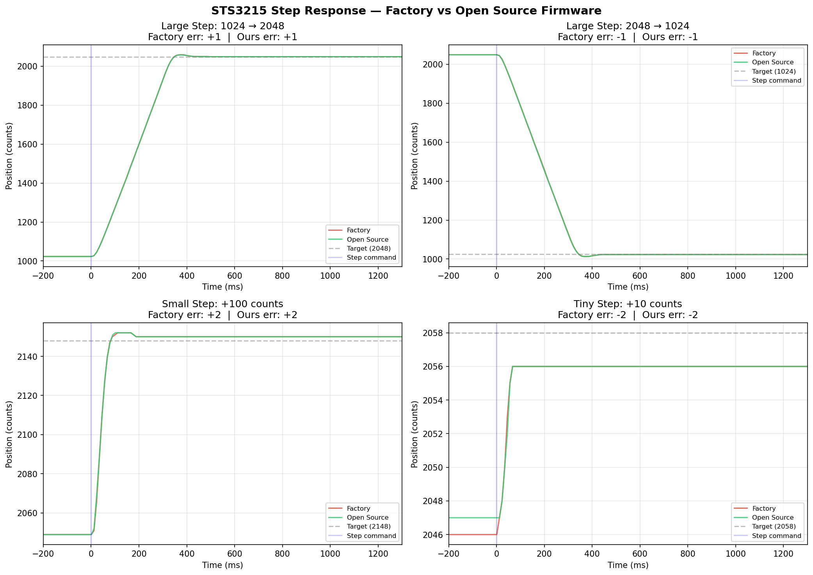

# Feetech STS3215 Servo — Open Source Firmware

An open-source, clean-room reimplementation of the Feetech STS3215 servo motor firmware for the GD32F130C6T6 microcontroller. Functionally equivalent to the factory firmware, verified on real hardware and through 15,000+ automated differential tests. Use at your own risk.

## Status

**Hardware verified** — flashed and tested on a real STS3215 servo via UART.

| Metric | Value |
|--------|-------|
| Differential tests | **385 pass** / 1 intentional diff |
| Fuzz tests | 13,630 pass (5 seeds) |
| Position accuracy | 1 count (identical to factory) |
| PWM displacement | 0.3-0.7% of factory (within motor variance) |
| Binary size | 15.6 KB (factory: 16.8 KB) |
| Bugs found & fixed | 24 |

All motor modes work: position (PID), speed (continuous rotation), PWM (direct drive), multi-turn, and current/torque control (mode 4 — new, not in factory firmware). Cold boot PWM startup in all 4 directions verified.

### Step Response Comparison

Factory (red) vs open source (green) position step response, measured on the same servo:



The two firmwares produce identical dynamic behavior — same response delay (~25ms for large steps), same settle time, and same final accuracy (±1 count). The response delay is caused by the firmware's internal acceleration profile, not UART latency.

**Tip:** Set CW/CCW dead zone registers (26-27) to 0 for exact positioning. Factory default of 1 causes ±1 count steady-state error.

## Hardware

The STS3215 is a TTL bus servo. The PCB (FT-S9.1.1-D-2211) has two sides:

### Front Side (MCU + Encoder)

The main MCU (GD32F130C6T6, QFP-48) sits on the front of the PCB with the servo bus connectors (2x JST, daisy-chain in/out). The AS5600 magnetic encoder reads a diametrically magnetized disc on the motor shaft via I2C. An electrolytic capacitor provides bulk power filtering.

### Back Side (H-Bridge + Power)

Four MOSFETs (Q1, Q2 pairs) form the H-bridge motor driver, controlled by TIMER0 complementary PWM outputs (CH0N on PA7, CH2N on PB1). A gate driver IC (U7) and current sense resistor (RS1) provide motor current feedback via ADC. Protection diode D3 handles back-EMF. The board runs from a single 6-12V supply with an onboard LDO for 3.3V logic.

### Pin Assignments (from firmware analysis)

| MCU Pin | Function | Connection |
|---------|----------|------------|
| PA2 | USART1 (half-duplex) | Servo bus DATA wire |
| PA7 | TIMER0_CH0N | H-bridge side A (via gate driver) |
| PB1 | TIMER0_CH2N | H-bridge side B (via gate driver) |
| PA6 | ADC / GPIO | Current sense (analog mode) or H-bridge enable (GPIO mode) |
| PA9 | I2C0_SCL | AS5600 encoder clock |
| PA10 | I2C0_SDA | AS5600 encoder data |
| PF0 | GPIO output | Status LED |

### Block Diagram

```
                         +-------------------+
                         |   GD32F130C6T6    |
   Servo Bus             |    (48 MHz MCU)   |
   (3-wire:              |                   |
    VCC/GND/DATA)        |                   |
         |               |                   |
   [PA2]-+- USART1 ------| Half-duplex UART  |
                         |   (up to 1 Mbps)  |
                         |                   |
                         |      TIMER0       |--[PA7] CH0N --> Q1/Q2 --|
                         |   (24 kHz PWM)    |--[PB1] CH2N --> Q3/Q4 --|-- DC Motor
                         |                   |                    |
                         |  [PA6] ADC in  <--|--- RS1 (shunt) <--|
                         |                   |
                         |       I2C0        |--[PA9]  SCL --+
                         |    (100 kHz)      |--[PA10] SDA --+--> AS5600
                         |                   |                   (magnet
                         |       ADC         |<-- NTC thermistor  on shaft)
                         |    (DMA ch0,      |<-- Voltage divider
                         |     continuous)   |
                         |                   |
                         |  [PF0] GPIO out --|--> LED
                         |                   |
                         |  TIMER15 (1us)    | Protocol timing
                         |  FWDGT (~1s)     | Watchdog
                         |  Flash (2x1KB)   | EEPROM emulation
                         +-------------------+

   VCC (6-12V) --+--[LDO 3.3V]--> MCU power
                  |
                  +--[H-Bridge]---> Motor + current sense
```

### Three-Wire Bus

The servo bus uses a single data wire (half-duplex UART) plus VCC and GND. Servos daisy-chain through two JST connectors. Each servo has a unique ID (0-253) and responds only to packets addressed to it or broadcast (ID 254).

## Source Structure

```
firmware/
  src/
    main.c             Entry point, system init, main loop
    servo_types.h      Register map, struct offsets, hardware constants
    uart_protocol.c    Feetech SCS/STS packet parser and command dispatch
    uart_subsys.c      UART ring buffer, DMA TX/RX, baud rate, register change detection
    pid.c              PID math, position/speed loops, stall detection, motion guards
    pid_motor.c        Goal computation, USART1 DMA init, timer0 duty control
    motion.c           Trapezoid velocity profile, acceleration/braking
    motor.c            Motor init, PWM output, safety shutdown, voltage monitoring
    encoder.c          AS5600 I2C encoder driver, multi-turn tracking, IIR filter
    i2c.c              I2C bus driver, event/error handler, ADC/DMA init
    eeprom.c           Flash EEPROM emulation (two-page wear leveling)
    servo_regs.c       Register side effects, EEPROM address mapping
    adc.c              ADC processing, temperature linearization, voltage/current sense
    led.c              LED blink patterns, alarm indication
    vtables.c          Function pointer tables for runtime mode switching
    util.c             Baud rate table, memcpy, memset helpers
  linker/
    GD32F130C6T.ld     Linker script (flash layout, SRAM, bootloader region)
    startup_gd32f130.s Vector table and C runtime init (Reset_Handler at 0xCC)
  lib/
    CMSIS/             ARM Cortex-M3 core headers + GD32F130 register definitions
    SPL/Include/       GD32F1x0 peripheral register defines (headers only)
  test/
    golden_test.py      Golden value tests (function logic, 93 assertions)
    golden_periph_test.py Peripheral + integration tests (full boot, UART, 119 assertions)
    regression_test.py  Regression tests for 24 bugs + invariants (180 assertions)
    periph_stubs.py     Peripheral memory model for emulation
  Makefile
tools/
  flash_tool.py        UART firmware update tool (AES-256-ECB encrypted blocks)
  encrypt.py           Firmware encryption for bootloader compatibility
  rescue.py            Recover bricked servos via bootloader power-cycle catch
pics/
  step_response_comparison.png  Factory vs open source step response
```

## Building

```bash
cd firmware
make            # Build firmware
make clean      # Clean build artifacts
```

Requires `arm-none-eabi-gcc`. Output is `build/scservo21.bin` (~16 KB).

## Flashing

The servo's factory bootloader handles firmware updates over the UART bus. Our firmware is encrypted with the same AES-256-ECB key the bootloader expects.

```bash
# Scan for servos
python3 tools/flash_tool.py --port /dev/ttyACM0 --scan

# Flash our firmware
python3 tools/encrypt.py firmware/build/scservo21.bin -o firmware.enc
python3 tools/flash_tool.py --port /dev/ttyACM0 --servo-id 1 --flash --firmware firmware.enc

# Flash factory firmware from Feetech server
python3 tools/flash_tool.py --port /dev/ttyACM0 --servo-id 1 --flash
```

The bootloader is preserved during UART flashing (it only writes to 0x08000000-0x080073FF). Factory firmware can always be restored.

### Restoring Factory Firmware

If you want to go back to the original Feetech firmware, the flash tool can download it directly from the Feetech update server:

```bash
# Restore factory firmware (downloads automatically from Feetech server)
python3 tools/flash_tool.py --port /dev/ttyACM0 --servo-id 1 --flash
```

This downloads the latest SCServo21 firmware, encrypts it for the bootloader, and flashes it. No backup needed — the factory firmware is always available from the server. The servo will behave exactly as it did from the factory after flashing.

### Rescuing Bricked Servos

If a servo stops responding after a failed flash (LED on but no UART response), it can be recovered via the bootloader. The bootloader is never overwritten by UART flashing and is always available.

```bash
# Connect ONLY the bricked servo (disconnect all others!)
python3 tools/rescue.py --port /dev/ttyACM0
# Follow the prompts to power cycle the servo
```

**Common causes of bricked servos:**
- **Multiple servos on the bus during flash** — the bootloader has no servo ID, so all powered servos enter bootloader mode simultaneously and the flash corrupts. Only flash with one servo on the bus, or use `--servo-id` with the flash tool (which sends a targeted reboot command before entering the bootloader).
- **Power loss during flash** — keep power stable during the ~10 second transfer.
- **Wrong firmware file** — use `encrypt.py` for our firmware, or let `flash_tool.py --flash` download the correct factory firmware automatically.

### Safety Guide

**Do not disable motor protection registers.** Register 19 (`alarm_shutdown`) controls which fault conditions shut down the motor. Writing 0 to this register disables all protection and can burn out the motor within seconds if it stalls or draws excessive current.

**Keep `max_output` (registers 48-49) conservative** when testing new firmware or modes. Start with low values (40-60) and increase gradually. This register caps the maximum PWM duty cycle regardless of what the PID computes.

**General testing tips:**
- Test with a loose servo on the bench, not mounted in an arm
- Keep the power supply current-limited if possible
- After any firmware change, verify position mode works before testing other modes

## Testing

Tests use Unicorn Engine to emulate the compiled firmware on an ARM Cortex-M3, checking function outputs and peripheral register writes against known-good values. No original factory binary needed.

```bash
cd firmware

# Golden value tests (93 assertions across 24 functions)
python3 test/golden_test.py

# Peripheral and integration tests (119 assertions — full boot, UART, PID, motor)
python3 test/golden_periph_test.py

# Regression tests for all 24 bugs + invariant checks (180 assertions)
python3 test/regression_test.py
```

Tests require `unicorn` (`pip install unicorn`) and `arm-none-eabi-nm` (from the ARM toolchain).

## Protocol

Half-duplex UART, single TTL wire, up to 1 Mbps:

```
Packet:    [0xFF] [0xFF] [ID] [LENGTH] [INSTRUCTION] [PARAMS...] [CHECKSUM]
Checksum:  ~(ID + LENGTH + INSTRUCTION + PARAMS) & 0xFF
```

| Instruction | Code | Description |
|-------------|------|-------------|
| PING | 0x01 | Query servo presence |
| READ | 0x02 | Read register(s) |
| WRITE | 0x03 | Write register(s) |
| REG_WRITE | 0x04 | Buffered write |
| ACTION | 0x05 | Execute buffered writes |
| FACTORY_RESET | 0x06 | Restore defaults |
| REBOOT | 0x08 | Reboot / enter bootloader |
| SYNC_READ | 0x82 | Multi-servo read |
| SYNC_WRITE | 0x83 | Multi-servo write |

### Operating Modes (register 33)

| Mode | Name | Description |
|------|------|-------------|
| 0 | Position | PID servo with acceleration profiles and angle limits |
| 1 | Speed | Continuous rotation at target velocity |
| 2 | PWM | Direct motor duty cycle control |
| 3 | Multi-turn | Position control without angle limits |

### Key Registers

| Register | Name | Description |
|----------|------|-------------|
| 6 | Baud Rate | Index 0-7 (default 0 = 1 Mbps) |
| 18 | Config | Motor/encoder configuration flags |
| 33 | Mode | Operating mode (0-3) |
| 40 | Torque Enable | 1 = motor active, 0 = coast |
| 42-43 | Goal Position | Target position (0-4095) |
| 44-45 | PWM Goal | PWM duty (sign-magnitude, bit 10 = direction) |
| 56-57 | Present Position | Current encoder position |
| 62 | Voltage | Supply voltage (0.1V units) |
| 63 | Temperature | Board temperature (degrees C) |

## License

MIT License. See [LICENSE](LICENSE) for details.

This is a **clean-room reimplementation**. No original source code was available or used. The GD32F1x0 peripheral library headers (under `firmware/lib/SPL/`) are provided by GigaDevice under their own license terms.
